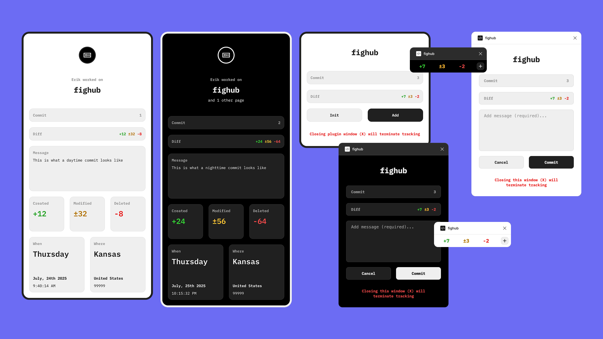

# Fighub – Git-Inspired Version Control for Figma

Fighub is a Figma widget that brings Git-style version control directly into your design workflow. It tracks all document changes — including creations, modifications, and deletions — and allows you to commit changes with messages, diffs, user data, timestamps, and location metadata.

## Key Features

* **Real-time change tracking**
Automatically logs new layers/styles, property changes, and deletions in your Figma document.

* **Commit history with messages**
Add descriptive commit messages to track design iterations.

* **Unlimited commits per widget or branch**
Each branch can store an unlimited number of commits for robust version history.

* **Detailed commit data**
Each commit includes diff details, user info, time of commit, and location data.

* **Adaptive commit themes**
Commit cards automatically switch between light and dark themes based on the time of commit.

## Why Fighub?

Fighub is designed to bring Git-like accountability and traceability to your Figma projects. Instead of losing track of design changes across multiple files or versions, you can log and review every modification directly on the canvas.

## Getting Started
1. Add Fighub to your Figma document.
2. Click “Init” to enable live monitoring of all changes.
3. When you’re ready to snapshot your work, click “Add".
4. Write a commit message and click "Commit".
5. Review your commit history right inside Figma.